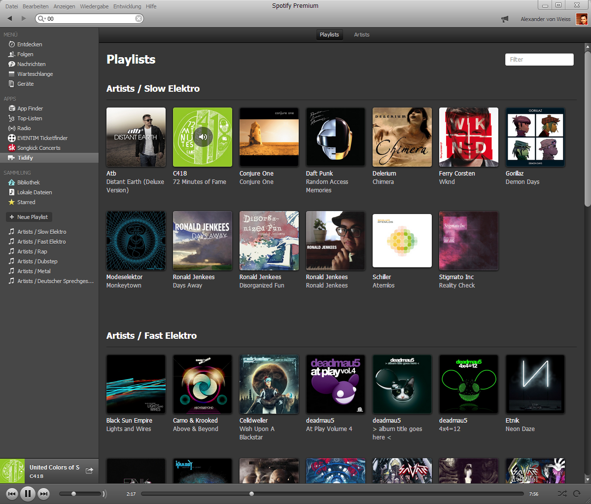
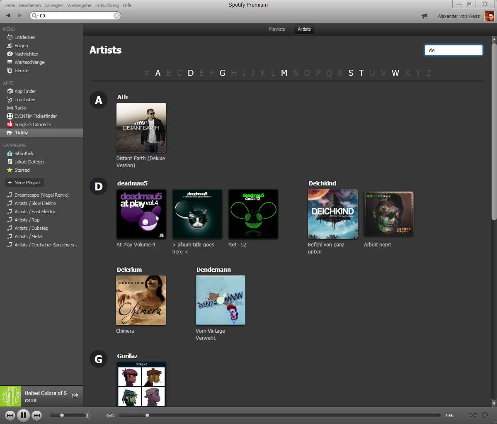

# My Albums (Spotify App)

Group your playlist tracks as albums

## Installation

 1. Sign up for a [developer account on Spotify](https://developer.spotify.com/technologies/apps/#developer) by logging in and agreeing to the [terms of use](https://developer.spotify.com/technologies/apps/terms-of-use/).
 2. Create the Spotify folder if it doesn't exist already: `~/Spotify` (Mac OS X and Linux) or `My Documents\Spotify` (Windows).
 3. Open the Spotify folder.
 4. Run `git clone https://github.com/sod/spotify-grouped-collection.git`.
 5. Download the [latest version of Spotify](http://spotify.com/download).
 6. Open Spotify and type `spotify:app:myalbums` in the search bar (restart Spotify completely in case it doesn't find the App at first).

Sadly you have to repeat step 6 every time you restart Spotify as this app is not listed on the App Finder.

## Resources

API 1.0: https://developer.spotify.com/docs/apps/api/1.0/index.html

## Screenshot

### Playlists tab (group albums by playlist)

### Artists tab (group albums by artist)

